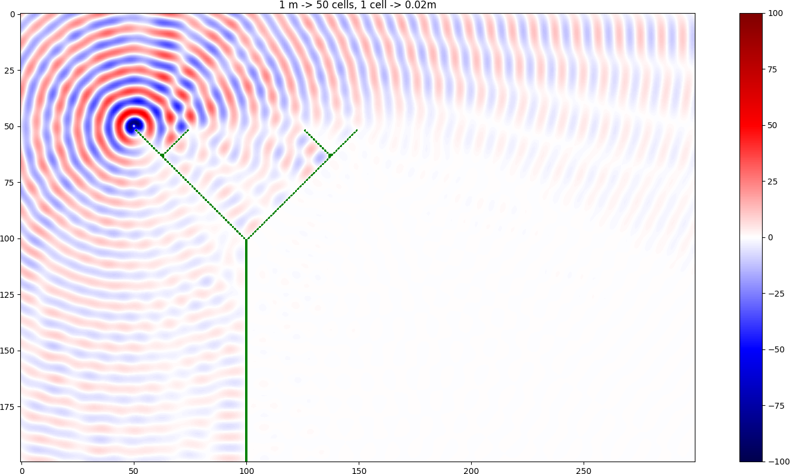

# Sound wave simulation

This project uses celural automata to simulate sound wave propagation and dampening by different shapes of walls
based on _Komatsuzaki T., Iwata Y., Morishita S. (2012) Modelling of Incident Sound Wave Propagation around Sound Barriers Using Cellular Automata. In: Sirakoulis G.C., Bandini S. (eds) Cellular Automata. ACRI 2012. Lecture Notes in Computer Science, vol 7495. Springer, Berlin, Heidelberg_

[My article describing this project](https://sunscrapers.com/blog/data-visualization-in-python-cellular-automata)



## Development
Use `pipenv` for managing dependencies https://github.com/pypa/pipenv#installation
``` bash
sudo apt install ffmpeg
pipenv install
```
Running
``` bash
pipenv shell
python main.py 1 # use 1,2,3 for different walls, 
python main.py 2 save # will save result as movie
```
